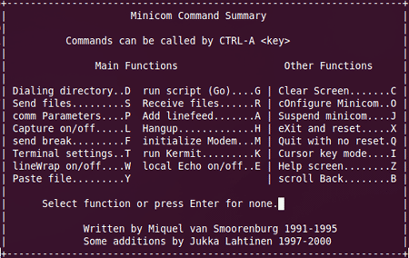
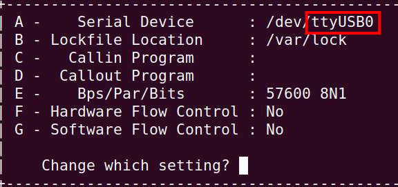
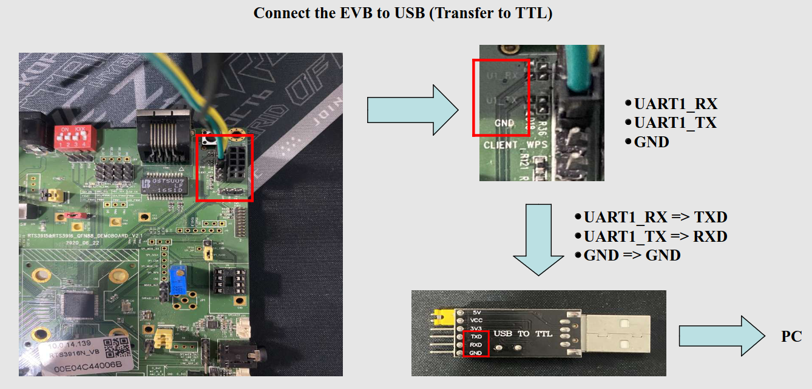
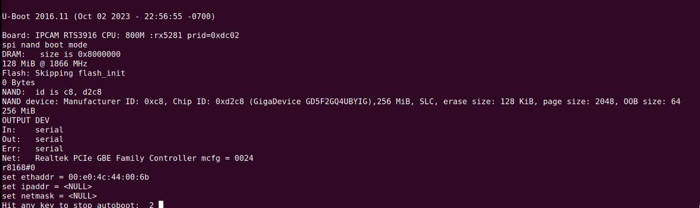
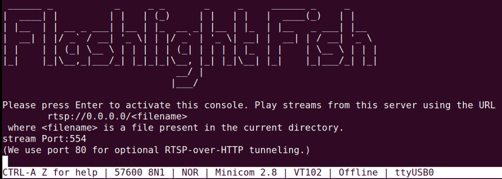
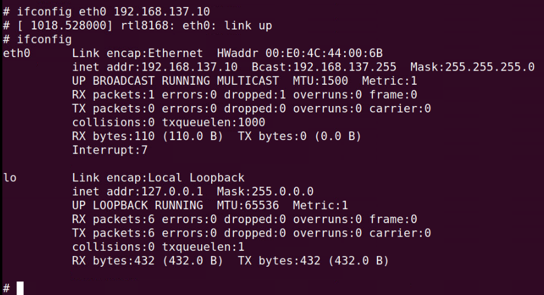
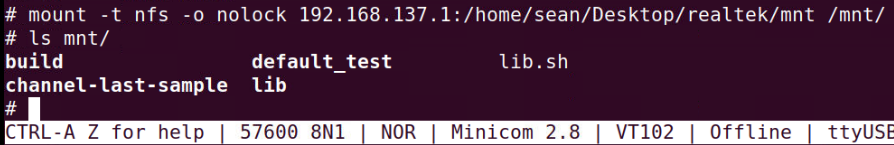

# <div align="center">Connect To Realtek Board</div>

<div align="center">
    
</div>

## <div align="center">Minicom</div>

***Minicom*** is used to communicate with the Realtek board. When the package is installed, we will power on the board and also use a 'USB to TTL' chip to receive data from the Realtek.

<details open>
<summary>Install</summary>

```shell
sudo apt install minicom
```

After install, you can execute following command and select **Serial port setup** to set the Bps/Par/Bits to **57600 8N1**:

```shell
sudo minicom -s
```

<div align="center">
    
</div>

</details>

<details open>
<summary>Usage</summary>

```shell
sudo minicom -D /dev/ttyUSB0
```

The '/dev/ttyUSB0' is a 'USB to TTL' chip. If you want to ensure which device is yours, you can use the command "sudo dmesg --follow" to check when the chip is connecting to your computer.

</details>

## <div align="center">NFS</div>

***NFS*** is used to share files or folders from your computer to the Realtek Board. We do this because when we complete transferring the model format, it allows the Board to use the model during inference.

<details open>
<summary>Install</summary>

```shell
sudo apt install nfs-kernel-server
```

</details>

<details open>
<summary>Usage</summary>

```shell
sudo vi /etc/exports
```

After entering edit mode, add the following rule:

```shell
# The following path is where it is shared to the board.
/home/sean/Desktop/realtek/mnt *(rw,no_root_squash,no_subtree_check,sync)
```

When saving your history, you should use the following command to update the settings:

```shell
sudo exportfs -r
```

</details>

## <div align="center">Reaktek Board</div>

<details open>
<summary>Power on the board</summary>

When you power on the board, you will see the message appear in your shell. Ensure entering minicom to commnuicate by USB to TTL chip.

<div align="center" style="font-size: 18px; font-weight: bold;">Wiring</div>

<div align="center">
    
</div>

<div align="center" style="font-size: 18px; font-weight: bold;">Received Message When Power ON</div>

<div align="center">
    
</div>

</details>

<details open>
<summary>Set up NFS</summary>

When you enter the shell as shown below, you can press the Enter button to interact with the board.

<div align="center" style="font-size: 18px; font-weight: bold;">Interact with Board</div>

<div align="center">
    
</div>

In the next step, we will first set the IP and then use the "mount" command to link the computer's specific path (Define in the /etc/exports) to the local position on the board.

```shell
ifconfig eth0 192.168.XXX.XXX
```

<div align="center">
    
</div>

Ensure both sides are on the same subnet; otherwise, the following step will fail. You can try "ping" command to check status.

```shell
mount -t nfs -o nolock 192.168.XXX.XXX:/path/to/your/folder/ /mnt/
```

<!--  -->

<div align="center">
    
</div>

</details>

Congratulations! You have completed this tutorial. You can refer to other documents below:

- [How To Transfer Model](../doc/transfer.md)
- [How To Excute the Inference](../doc/inference.md)
- [How To Display Frame In Real-Time](../doc/display.md)
