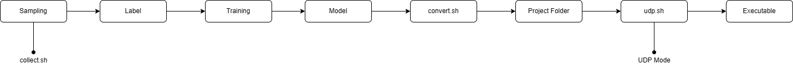

# <div align="center">How To Display Frame In The Real-Time</div>

There are two different ways to display the AI model inference result frames in the window in real-time, and the following list is shows our methods of transporting the image with bounding boxes from the board to display window on PC:

- NFS
- UDP

## <div align="center">How to Start</div>

We provide another repository containing more detailed information. Inside, there is a README.md file that describes how to use these files.

<details open>
<summary>Clone</summary>

```shell
# This command will require you to enter a key to access. Please contact us, and we will provide the key for you.
git clone https://github.com/InstAI-Co/Realtek-RTS3916n-Display-Multiple-Image.git
```

After setting up the environments, you can select one of the modes to use.

</details>

<details open>
<summary>Usage</summary>

### NFS

```shell
python src/display-real-time.py path/to/stream/image/
```

Since the NFS mode will generate multiple images in the sharing folder, it means that whenever the AI model inference result frame is saved in the folder (bitmap format), the PC-side will capture the latest frame and display it in the window to achieve real-time AI inference.

### UDP

It is the same way to cross-compile your project, like selecting stream mode. After compiling the project by executing the script named `udp.sh`, you will get the `build` folder in the project named `transfer_model`.



<details open>
<summary>Compile</summary>

```shell
sh /udp.sh transfer_model
```

After the build is completed, you can just put the executable files into NFS sharing folder (`/mnt` on the board) to see the detection result.

```shell
# Remember to execute the files on the board
./yolov3tiny network_binary.nb
```

</details>

<details open>
<summary>UDP Server</summary>

There is one last step to do. Before starting, clone the repository first.

```shell
# This command will require you to enter a key to access. Please contact us, and we will provide the key for you.
git clone https://github.com/InstAI-Co/Realtek-RTS3916n-Display-Multiple-Image.git
```

We suggest you use the `pyenv` tool to set up your environment. Remember to install Python version `3.10.12` and follow the command below.

```shell
python3 -m venv myenv
source myenv/bin/activate
pip install --upgrade pip==24.0
pip install -r requirements.txt 
```

Now, just execute the code to receive an image from the board.

```shell
python src/udp-server.py <IP> <PORT> <RESIZE_WIDTH> <RESIZE_HEIGHT>
```

This is an efficient way to display the frames because it provides an event-triggered mechanism (via UDP) to  transfer the AI inferenced results frames from the Realtek EVB to PC, which shows low latency compared with NFS-based transport.

</details>

Congratulations! You have completed this tutorial.
