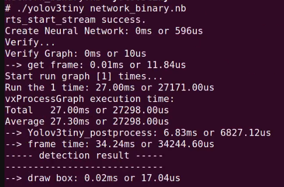

# <div align="center">How To Excute the Inference</div>

You must have completed the tutorial in the previous step to get the `transfer_model` project and followed the [cross-compile](./transfer.md) document to get the executable files in folder `transfer_model/build`. In this document, we will explain how to transfer your files from PC to the board and execute AI model inference.

## <div align="center">How to Start</div>

Remember, in the beginning, we [set up NFS](./connect_board.md) to share the path specified in config file `/etc/exports`. Here, we will place our `build` folder into the sharing folder. Then, we will execute the file on the board to implement AI inference.

<details open>
<summary>Inference</summary>

Assume you have completed the necessary commands in the previous step. Just place your build folder into `/mnt` (On the PC: path specified in config file `/etc/exports`).

```shell
# On the Board-Side
ls /mnt/build
```

Terminal response:

```shell
network_binary.nb yolov3tiny
```

And then, you can execute specific files like this:

```shell
./yolov3tiny network_binary.nb
```

If it works, you will see the output like below:

<div align=center>
    <p>
        <a href="https://www.instai.co/">
            
        </a>
    </p>
</div>

</details>

Congratulations! You have completed this tutorial. You can refer to other documents below:

- [How To Display Frame In Real-Time](./display.md)
