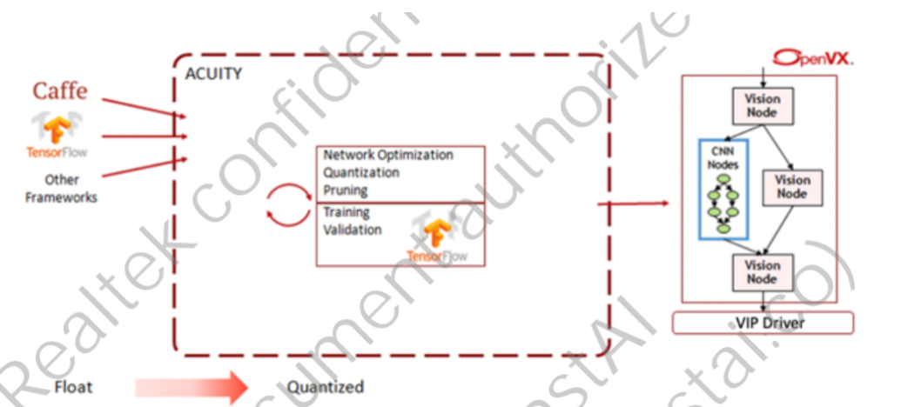
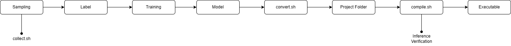

# <div align="center">How To Transfer Model</div>

Before running the inference feature, you need to have a model ready. We provide a YOLOv3-tiny structure for implementing your model. The first step is to use your personal model as input, and then transfer your model to a specific format to enable it to run on the Realtek 3916n.

The image below describes the procedure. We will use "acuity tool" to convert your model here.



## <div align="center">How to Start</div>

We provide the Container to let user can easyily sampling, convert model and cross compile. you can download [here](https://drive.google.com/file/d/1NfLpzos6K0CqWbVXyVpKC9tl2tViwrFs/view?usp=sharing).

<details open>
<summary>Load/Run Container</summary>

```shell
# Load Image
docker load -i container.tar

# Run Container
docker run -it --rm -v $(pwd):/workspace/ --workdir /workspace instai/transfer_model:v3
```

Before starting, let's briefly explain the different features. As you can see, there are three main functions:

`collect.sh`: Collect images from the camera.

`convert.sh`: Convert the input model to a specific format.

`compile.sh`: Cross compile the project.

`upd.sh`: (optional) Cross-compile the project and send data to the UDP server (Refer to [UDP](../doc/udp.md))



</details>

<details open>
<summary>Sampling</summary>

```shell
sh /collect.sh
```

After executing the command, you will get the collect folder. Inside this folder, you will find the executable files. Just execute the command below to save the image on the Realtek 3916n:

```shell
# Remember to execute the files on the board, not in the Docker container
cd collect
./yolov3tiny network_binary.nb
```

</details>

<details open>
<summary>Convert</summary>

```shell
sh /convert.sh <model-name>.cfg <model-name>.weights
```

After executing the script, it will copy the result named `transfer_model` to your current directory. This folder contains the model structure and other important information, so if it is not necessary to edit, don't touch it.

</details>

<details open>
<summary>Compile</summary>

```shell
sh /compile.sh transfer_model/
```

After executing the script, it will show two options below:

```shell
1.Inference
2.Verification
select mode:
```

`Inference`

- Capture camera frame, perform inference, and save the result as a bitmap.

`Verification`

- Receive a JPG input file, perform inference, and save the result as a bitmap and TXT file containing label positions.

Hint: In the Inference mode, there are two types that can be selected after you choose the mode.

After selecting the mode, you need to enter the correct number of classes. Otherwise, it will fail when you deploy it on the board.

```shell
# Input 
Classes Num:
```

After Cross Compile, you will get the `build` folder inside the `transfer_model`:

```shell
# Two necessary files
ls transfer_model/build
network_binary.nb  yolov3tiny
```

</details>

Congratulations! You have completed this tutorial. You can refer to other documents below:

- [How To Excute the Inference](../doc/inference.md)
